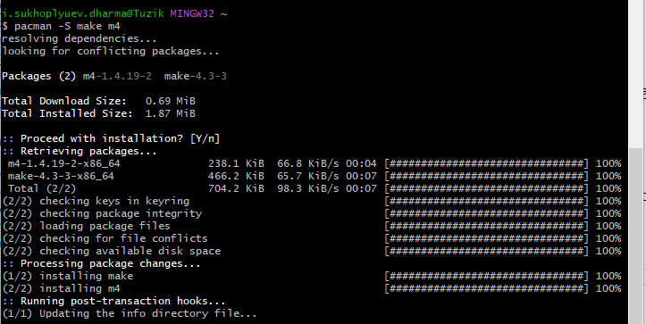
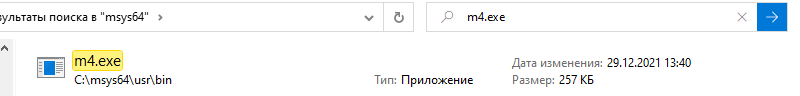
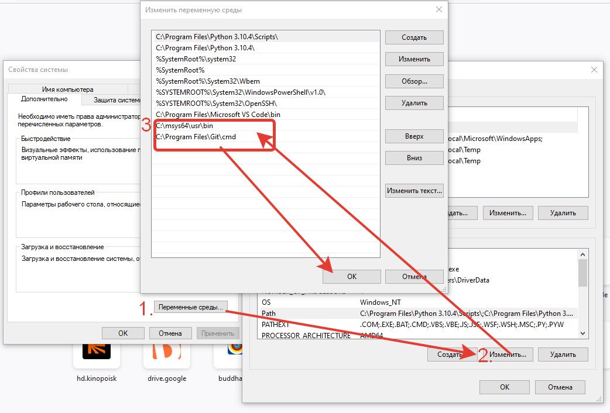
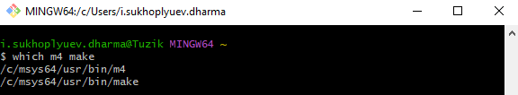

# 20220914 Привет, Мир! или Первый шаг к преподаванию

Всем Привет, Я [Сухоплюев Илья](/cv/), начинаю писать это блог, чтобы разобраться
с собой, закрепить свои знания в Программировании и собрать и обобщить собранные
знания.

Закончив бакалавриат в [УрФУ](https://urfu.ru/ru/) (г. Екатеринбург) и магистратуру
в [Университете Иннополис](https://innopolis.university/), я участвовал в сильном
проекте по созданию специализированного драйвера Файловой системы FAT32 для
[диктофона Сорока](https://www.labi2.ru/produkciya/miniatyurnye-diktofony/).

TODO: связать переход на [Алабуга Политех](https://alabuga-polytech.ru/)
и подвести к подготовке на Преподавателя в Академию ТОП ...


## TODO: План действий

- [X] Настройка рабочего окружения
- [ ] Обновить резюме. Проверить адекватность PDF-версии
- [ ] Подготовка к 3D-резюме по:
    - [ ] Основы WEB-Дизайна
    - [ ] Разработке WEB-страниц на Языке Разметки HTML5 и Каскадных Таблиц Стилей CSS3
    - [ ] Разработка клиентских сценариев с использованием JavaScript
    - [ ] Введение в создание WEB-Приложений с использованием Angular и React
    - [ ] Создание WEB-Приложений, исполняемых на стороне сервера при помощи
          языка программирования PHP и СУБД MySQL
    - [ ] Content Management System (CMS). Wordpress
- [ ] (Дополнительно): Сделать генерацию и публикацию Мини-Блога на Python

## Настройка рабочего окружения

Изначально мой сайт начинался, как эксперимент на [GNU m4](https://www.gnu.org/software/m4/) -
программы, обобщающей [препроцессор на языке C](https://ru.wikipedia.org/wiki/%D0%9F%D1%80%D0%B5%D0%BF%D1%80%D0%BE%D1%86%D0%B5%D1%81%D1%81%D0%BE%D1%80_%D0%A1%D0%B8).
Работа в таком формате оказалось утомительной - хочется быстро написать заметки
в Markdown и опубликовывать. Поэтому генераторы статических сайтов типа
[Jekyll](https://jekyllrb.com/) оказались куда интереснее. Совместив Markdown
c [Python-шаблонизатором Mako](https://www.makotemplates.org/), работая в Алабуге
я получил очень интересный [результат](https://github.com/Suhoy95/webpy-alabuga/blob/main/publish-zettelkasten.py),
который хочется довести до ума и прийти окончательно.

### Настроим Make и m4 в git-bash

В Git-Bash уже есть *nix-окружение, но к сожалению оно урезано. Как предлагали
на [stackoverflow](https://stackoverflow.com/questions/32712133/package-management-in-git-for-windows-git-bash)
можно было бы поставить Git for Windows SDK, который не урезает пакетный менеджер `packman`.
Но он достаточно большой для ноутбука на SSD, поэтому выбор пал на [Msys2](https://www.msys2.org/) в
который мы поставим необходимые пакеты для сборки.



Теперь остается найти установленные программы:



И добавить путь до них в переменную окружения PATH:



Проверяем, что все работает:



### Настройка сборки в VSCode

Чтобы VSCode увидел изменения в PATH, его потребуется перезагрузить.
После чего можно настроить `.vscode/task.json`, чтобы проект собирался по горячим клавишам
`Ctrl+Shift+B`:

```json
{
    // See https://go.microsoft.com/fwlink/?LinkId=733558
    // for the documentation about the tasks.json format
    "version": "2.0.0",
    "tasks": [
        {
            "label": "make",
            "type": "shell",
            "command": "make",
            "problemMatcher": [],
            "group": {
                "kind": "build",
                "isDefault": true
            }
        }
    ]
}
```

Остается поставить [Live-Server](https://marketplace.visualstudio.com/items?itemName=yandeu.five-server),
который будет показывать и обновлять черновик сайта в реальном времени.

## Обновление резюме