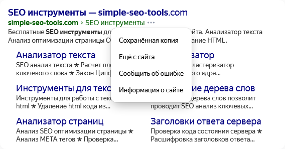

# 202210051456 Школа SEO. Основной курс заметки

Заметки по Плейлисту [YouTube: Школа SEO основной курс](https://www.youtube.com/watch?v=dMWWYsly_Wo&list=PL3MUz5vmQVkIMR4k2IGQlzsiLqDRB06WU&index=1)

## 1. Основные принципы SEO / Базовые принципы Поисковой Системы

1. Поисковая Система ищет не по всему интернет, она ищет по свой **Базе Данных** (Индексе).
    Итого запись в  БД состоит из:
    1. Файла первичного содержания
    2. Набора ссылок
    3. Набор обработанных маркеров
2. Базу Данных заполняет поисковой бот(-ы):
    1. Ищет контент на странице.
        Результат - файл/содержание страницы, 
        - содержание страницы перед сохранением в БД, происходит пред-обработка страницы. В частности Частотную таблицу слов (Плотность слов).
        - Пред-обработка нужна для ускорение поиска слов.
    2. Ищет ссылки на странице, и направляет Поискового Бота. То есть поисковой Бот движется по ссылкам
        Результат - связи с другими страницами
3. Программа пред-обработки - **Индексер**, Процесс сканирования страниц и занесение их в БД - **Индексация**.
4. Поисковая машина (SE - Search Engine) - (сложными совами): Программно аппаратный комплекс, который занимается поиском и сортировкой результатов поиска
    3.1 релевантность - адекватность, relevance-соответствие. Релевантные, адекватные результаты поиска.
    Мы часто задаем не очень адекватные результаты: например запрос "Гольф" - это машина, спорт или одежда? И поисковик пытается отследить, что ожидает конкретный пользователь от конкретного запроса в конкретной местности
    3.2 ранжирование - сортировка по релевантности. 
        - Оптимизация может быть по релевантным запросам и по нерелевантным запросам.
5. WEB-сервер

> Информационный поиск - это часть науки кибернетика.

### Практические выводы:

1. Чтобы новая страница попала в **Индекс**, самый простой способ - создать ссылку на нашу страницу из популярных сервисов, которые уже проиндексированы.
2. Проверить, есть ли сайт в индексе: `site:example-domain.com`
3. У поисковика можно посмотреть сохраненную копию: (или)

Базовый алгоритм, на основе полученных определений
1. Проверить, что сайт правильно проиндексирован
2. Сделать сайт, адекватно и корректно отвечающий запросу пользователя. 

## 2. Что такое релевантность и Вес сайта (базовые принципы ранжирования)

Базовый алгоритм:
- Взять текст, и сделать частотную таблицу: 
- верхушка частотной страницы будет определять содержимое страницы.

Есть проблема с тем, что никто не запрещает автору сайта написать любимое слово много раз.
Сейчас алгоритм стал сложнее, и использует машинное обучение. Это подразумевает:

1. В ручную выбранные "эталонные, релевантные страницы"
2. Автоматический поиск и анализ разнообразных сигналов "хорошего сайта":
    - Плотность ключевого слова = Количество упоминаний / количество слов. 
        > Для каждого слова и языка будет разная. Нет **идеальной плотности ключевого слова**

Чем отличился 1998 году Гугл от других Поисковых систем? 
- Предложили посмотреть не просто текст, а также общий вес страницы

Лари Пейдж сделал алгоритм Page Rank (Игра слов Показатель Пейджа):
- давайте считать ссылку на страницу рекомендацией этой страницы/
    любая ссылка на страницу передает вес на целевую страницу, 
    и чуть уменьшает вес страницы (**страницы-донара**), содержащий эту ссылку, так как увеличился шанс выхода со страницы, что понижает шанс нахождения на сайте в данный момент.

важно понимать вероятность перехода:
1. Количество ссылающихся страниц
2. Качество ссылающихся страниц

Есть мнение: что PageRank более не актуален:
- Публичные PageRank Гугл больше не будет поддерживать, но это не говорит о том, что алгоритм PageRank использоваться. 
PageRank до сих пор входит в тройку основных алгоритмов при проверке на релевантность, включая частотную таблицу.

Важно в каком порядке идет анализ:
1. сначала релевантность
2. а потом только важность страницу

### Полезные выводы

1. Можно взять топ выборки, и считать их как "эталонную выборку".
    - Минус такого подхода - что в низко-конкурентных средах, сайты плохо оптимизированы 
2. Делайте контент для людей
    - Плюс в том, что эталонная выборка основана на субъективном мнении людей
    - Одно серьезное но: ошибки в понимании этого совета:
        Контент должен быть Информативным и Тематическим
3. Все СЕО разбивается на три слоя:
    1. Индексация сайта
    2. Релевантность сайта
    3. Вес сайта (например, PageRank), вес бесполезен без последних двух

## 3. Составление Семантического ядра, сбор статистики

Семантическое ядро - это **максимально полный** перечень **всех слов** и **словосочетаний**, с помощью которых люди ищут информацию, которую мы предоставляем.

> Мы не должны выдумывать ключевые слова, а должны собирать их с поисковых систем. 

1. Google: [Keyword planner](https://keywordtool.io/) - к сожалению, без использования контекстной рекламы мы не сможем им пользоваться. 
2. Yandex: [Yandex Word Stat](https://wordstat.yandex.ru/)

Работа:
1. Вбиваем несколько стартовых фраз, по которым мы бы искали страницу. Очень важно группировать стартовые запросы по тематикам.
2. Выбираем Таргетинг, регион и язык.
3. Нас интересует:
    - сами словосочетания 
    - их частотность, а 
    - также рекомендации по ключевым словам, которые люди ищут связно в рамках одной поисковой сессии. Вот их то и используем для составления семантического ядра.

Среднее число запросов в месяц - частотность входной фразы.

4. Пробуем разные входные фразы, набираем много данных-рекомендаций
5. Удаляем повторяющиеся дубликаты
6. Чистим запросы:
    1. удалить навигационные запросы других компаний
    2. Выделить на две группы информационные и коммерческие запросы
    3. Мы должны обращать внимание низко-популярные конверсионные запросы

Виды запросов:
1. навигационные, когда использует Поисковик как элемент навигации
    - Бывают скрытые информационные запросы: например "новости сегодня", то есть новости на сайте "сегодня.
    - навигационные запросы чаще всего не нужны нам в семантическом ядре.
2. информационные, когда человек просто ищет информацию. При этом обычно человеку не важно на каком именно сайте он найдет информацию. Обычно люди идущие по информационным запросам не заинтересованы в каких-либо коммерческих запросов. 
3. коммерческие, 
    - Неплохо группировать отдельно Коммерческие и информационные запросы.
    - не каждый коммерческий запрос подразумевает какое-то действие, а с точки зрения информации для покупки например.
    - когда человек приходит за каким то действием, например модель устройства, то такой вопрос называется **конверсионным**, они обычно с большим количеством уточнений и очень меньшую частотность, которые не стоит выкидывать, потому что такие запросы больше всего приносят эффективности. 

### Инструменты

- [Simple Seo Tools](http://simple-seo-tools.com/)
- [ЛеммаТОП](http://topka.yula-group.ru/colocator/)
- [Yandex Word Stat](https://wordstat.yandex.ru/)
- [Plug-In: Yandex WordStat Helper](https://addons.mozilla.org/ru/firefox/addon/yandex-wordstat-helper/)
- Платные сервисы для составления семантического ядра:
    - [Key Collector](https://www.key-collector.ru/)
    - [SpyWords](https://spywords.ru/)

## Обратные ссылки

Создано при подготовке к 3D-резюме в [Академию ТОП](https://izh.top-academy.ru/).

- [Статья, посвященная подготовке](../blog/20220914-preparing-for-teaching.md)
- [Разделы подготовки по WEB-разработке](./202209141344-web-design.md)
- [Раздел по подготовке к SEO](./202210051435-top-seo.md)
